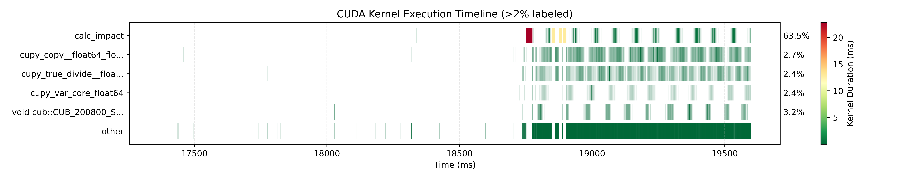
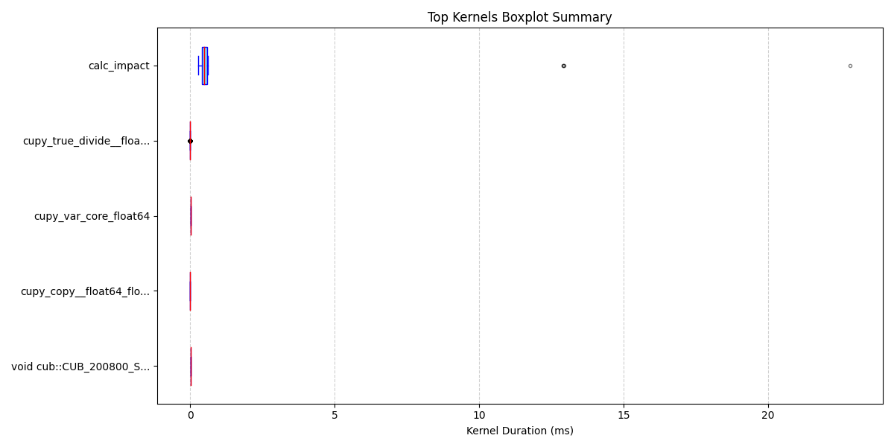
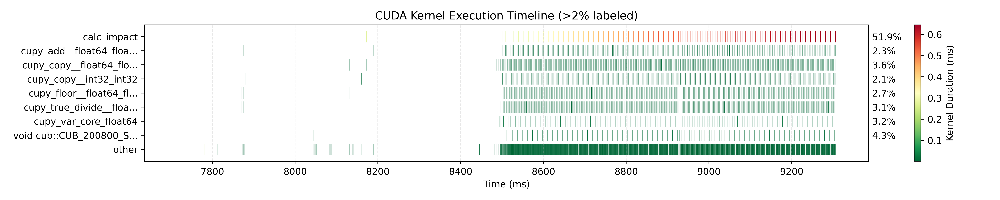
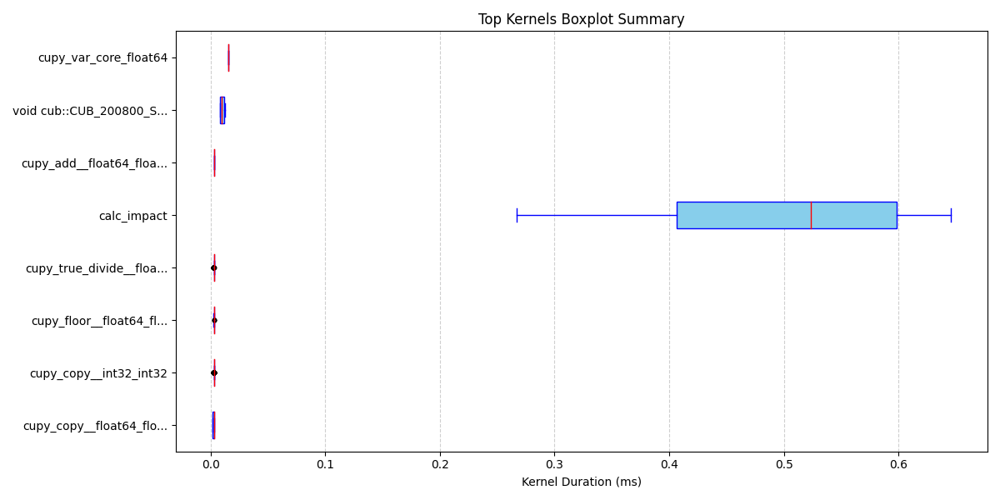

# nsight2pyplot

## Description

nsight2pyplot is a set of bash and Python scripts to process the output of CUDA Nsight and plot the profiling information using matplotlib.

## Usage

nsight2pyplot requires an input of an NVIDIA nsight SQLITE file. After profiling a CUDA application using `nsys profile`, the main script accepts the file prefix (without the `.sqlite` suffix).

`plot_profile.sh profile_prefix` runs Python scripts to plot the runtime of the kernels in a timeline format and a boxplot format. `profile_prefix` is the prefix for the files generated by `nsys profile`. `plot_profile.sh` will look for `profile_prefix.sqlite` to read in the profiling information.

The timeline plot takes the kernels that constitute over 2% of the total kernel runtime and plots their durations on a `broken_barh` plot, with the kernels that take less than 2% of the time grouped into "other". The runtime of the individual kernel runs are also colorcoded from green to red, with red for the longest kernel runtimes. Where kernels run for a short time with little time between invocations, such as in the "other" category, the plot is likely to appear as a solid block of green without space distinguishing between one kernel run and the next.

The boxplot displays the summary statistics for the kernels that make up over 2% of the kernel runtime (with no "other" category).

### Usage with OACIS

Though nsight2pyplot works as a standalone script, it is designed to work with [OACIS](https://github.com/crest-cassia/oacis). When using nsight2pyplot within OACIS, the image files created by the scripts will then be in the directory for OACIS so that they may be displayed in the list of output files and in the figure viewer.

The commands to run the simulation script with the profiler and then create the visualizations of the profile can be called as:

```
nsys profile --stats=true --cuda-memory-usage true SIM_SCRIPT && ~/PATH_TO/nsight2pyplot/plot_profile.sh report1
```

`nsys profile` will log the profiling information from the script's run. The input to `plot_profile.sh` of `report1` assumes that the goal is to display the results from the first profile in the current directory using the default output file names.

### Versions and Dependencies

nsight2pyplot has been tested with the following versions of `nsys`:

- 2021.2.4.12
- 2024.5.1.113

Other `nsys` versions may also work but have not been tested. Different versions use different file names and labels for the kernel profiles. If you add support for an additional `nsys` version, please make a pull request so we can add it to the project.

As well as `nsys`, running the scripts requires the following programs and packages, and has been tested with the specified versions, but may work with other versions:

- `sqlite3` (version 3.40.0)
- `python3` (version 3.10.8)
- Python packages:
    - `sys`
    - `collections`
    - `csv` (version 1.0)
    - `matplotlib` (version 3.6.3)
    - `pandas` (version 1.5.3)
    - `numpy` (version 1.23.5)

## Examples

Below are the timeline and summary figures for one CUDA application, where an error is causing some kernels to have much higher runtimes than other iterations of the same kernel:





The following figures are for a run of the same application after the bug is fixed, so the kernel times are consistent across each iteration:





## Future Development

nsight2pyplot current creates plots for the kernel runtimes based on the SQLITE output from `nsys profile`. Potential future features include:

- plots for memory operations
- plots for memory usage
- additional input file types
- support for more versions of `nsys`